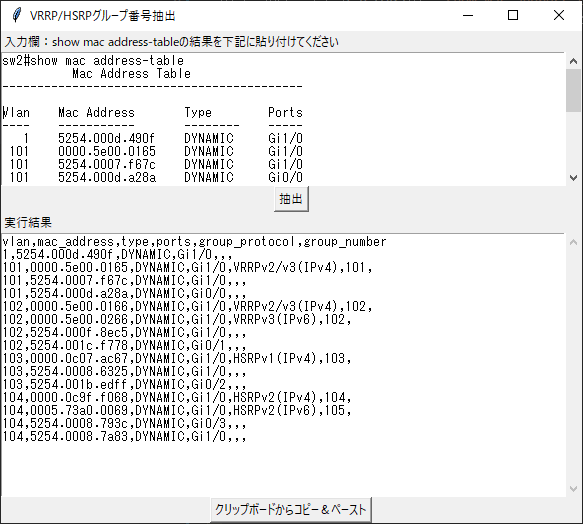

# pyparsemactable

This is a tool to extract the VRRP/HSRP group number from the cisco's "show mac address-table".

このツールは、シスコCatalystの```show mac address-table```から
VRRP/HSRPの仮想MACアドレスからグループ番号を抽出するGUIツールです。

「[ルータ冗長プロトコルのVRRP/HSRPのグループ番号をMACアドレスから確認する](https://kooshin.hateblo.jp/entry/202110_vrrp_hsrp_group_number_by_mac_address)」で、VRRP/HSRPのグループ番号を抽出する方法を説明しています。

# 使い方

1. 「入力欄」に```show mac address-table```の結果を貼り付け
2. 「抽出」ボタンを押す
3. 「実行結果」にカンマ区切りで抽出結果が表示

## クリップボードからコピー＆ペースト

「クリップボードからコピー＆ペースト」は、クリップボードから「入力欄」にコピーし、
「実行結果」をクリップボードに上書きします。

# 実行例



## show mac address-tableの例

```cisco:Input Text
sw2#show mac address-table 
          Mac Address Table
-------------------------------------------

Vlan    Mac Address       Type        Ports
----    -----------       --------    -----
   1    5254.000d.490f    DYNAMIC     Gi1/0
 101    0000.5e00.0165    DYNAMIC     Gi1/0
 101    5254.0007.f67c    DYNAMIC     Gi1/0
 101    5254.000d.a28a    DYNAMIC     Gi0/0
 102    0000.5e00.0166    DYNAMIC     Gi1/0
 102    0000.5e00.0266    DYNAMIC     Gi1/0
 102    5254.000f.8ec5    DYNAMIC     Gi1/0
 102    5254.001c.f778    DYNAMIC     Gi0/1
 103    0000.0c07.ac67    DYNAMIC     Gi1/0
 103    5254.0008.6325    DYNAMIC     Gi1/0
 103    5254.001b.edff    DYNAMIC     Gi0/2
 104    0000.0c9f.f068    DYNAMIC     Gi1/0
 104    0005.73a0.0069    DYNAMIC     Gi1/0
 104    5254.0008.793c    DYNAMIC     Gi0/3
 104    5254.0008.7a83    DYNAMIC     Gi1/0
Total Mac Addresses for this criterion: 15
```

## 実行結果

```csv:Output Text
vlan,mac_address,type,ports,group_protocol,group_number
1,5254.000d.490f,DYNAMIC,Gi1/0,,,
101,0000.5e00.0165,DYNAMIC,Gi1/0,VRRPv2/v3(IPv4),101,
101,5254.0007.f67c,DYNAMIC,Gi1/0,,,
101,5254.000d.a28a,DYNAMIC,Gi0/0,,,
102,0000.5e00.0166,DYNAMIC,Gi1/0,VRRPv2/v3(IPv4),102,
102,0000.5e00.0266,DYNAMIC,Gi1/0,VRRPv3(IPv6),102,
102,5254.000f.8ec5,DYNAMIC,Gi1/0,,,
102,5254.001c.f778,DYNAMIC,Gi0/1,,,
103,0000.0c07.ac67,DYNAMIC,Gi1/0,HSRPv1(IPv4),103,
103,5254.0008.6325,DYNAMIC,Gi1/0,,,
103,5254.001b.edff,DYNAMIC,Gi0/2,,,
104,0000.0c9f.f068,DYNAMIC,Gi1/0,HSRPv2(IPv4),104,
104,0005.73a0.0069,DYNAMIC,Gi1/0,HSRPv2(IPv6),105,
104,5254.0008.793c,DYNAMIC,Gi0/3,,,
104,5254.0008.7a83,DYNAMIC,Gi1/0,,,
```

# 対応ルータ冗長プロトコル

対応しているルータ冗長プロトコルは下記の通りです。

| ルータ冗長プロトコル | IPバージョン | グループ番号範囲 | 仮想MACアドレス(Cisco表記) | 仮想MACアドレス(:表記) | 仮想MACアドレス(-表記) |
|----------------------|--------------|--------------|-------------------|---|---|
| VRRPv2/v3            | IPv4         | 1-255        | 0000.5e00.01xx | 00:00:5e:00:01:xx | 00-00-5E-00-01-XX |
| VRRPv3               | IPv6         | 1-255        | 0000.5e00.02xx | 00:00:5e:00:02:xx | 00-00-5E-00-02-XX |
| HSRPv1               | IPv4         | 0-255        | 0000.0c07.acxx | 00:00:0c:07:ac:xx | 00-00-0C-07-AC-XX |
| HSRPv2               | IPv4         | 0-4095       | 0000.0c9f.fxxx | 00:00:0c:9f:fx:xx | 00-00-0C-9F-FX-XX |
| HSRPv2               | IPv6         | 0-4095       | 0005.73a0.0xxx | 00:05:73:a0:0x:xx | 00-05-73-A0-0X-XX |

# 動作環境

* Python 3.10.0
* Windows 10 21H1
